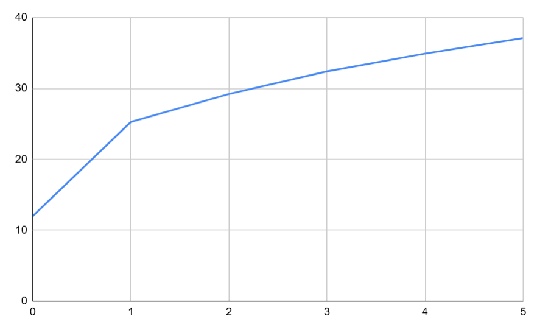

## Комп'ютерні системи імітаційного моделювання
## СПм-24-3, **Прошкін Артем Сергійович**
### Лабораторна робота №**1**. Опис імітаційних моделей та проведення обчислювальних експериментів

 

### Варіант 2, модель у середовищі NetLogo:
[Climate Change](https://www.netlogoweb.org/launch#http://www.netlogoweb.org/assets/modelslib/Sample%20Models/Earth%20Science/Climate%20Change.nlogo)

 

### Вербальний опис моделі:
Ця модель є симуляцією кліматичної системи Землі, призначеною для демонстрації парникового ефекту. Вона моделює, як сонячна енергія надходить, взаємодіє з атмосферою та поверхнею Землі, і як парникові гази CO2 утримують тепло.

### Керуючі параметри:
- **albedo** визначає відбивну здатність поверхні Землі (від 0 до 1). Контролює, яка частка сонячних променів буде поглинута (стає heats), а яка відбита назад в атмосферу.
- **sun-brightness** визначає інтенсивність сонячного випромінювання, тобто, як часто створюються нові агенти сонячного світла.
- **CO2** кількість груп агентів молекул CO2 в атмосфері (в групі 25 молекул).
- **cloud** кількість кластерів хмар в атмосфері.

### Внутрішні параметри:
- **sky-top**. Глобальна змінна, що визначає Y-координату верхньої межі атмосфери (межі з космосом).
- **earth-top**. Глобальна змінна, що визначає Y-координату поверхні Землі (встановлена на 0).
- **cloud-speed**. Властивість, що належить агентам-хмарам (clouds), яка визначає їхню індивідуальну швидкість горизонтального руху.
- **cloud-id**. Властивість агентів-хмар, що групує окремих агентів у загальний кластер великої хмари.
 
### Показники роботи системи:
- **temperature**. Основний показник роботи моделі. Глобальна змінна, яка розраховується на кожному такті. Вона не керується напряму, а є результатом симуляції, що плавно прямує до значення, залежного від поточної кількості агентів heats (тепла) всередині "Землі".

### Примітки:
Хмари та CO2 виконують протилежні функції. Хмари охолоджують систему, відбиваючи вхідне сонячне світло ще до того, як воно досягне Землі. CO2 нагріває систему, відбиваючи вихідне інфрачервоне випромінювання назад до Землі, заважаючи теплу покинути атмосферу.

### Недоліки моделі:
Випромінювання тепла з Землі відбувається не по всій поверхні, а лише на обмеженій ділянці. Це зроблено для візуальної привабливості симуляції, але це суперечить фізичній реальності, де тепло випромінюється з усієї поверхні, і в тому числі з неосвітлених частин планети. В реальному житті хмари можуть уповільнювати вихід тепла з поверхні землі (утримувати частину інфрачервоного випромінення) тим самим частково мати властивості парникового газу, в моделі цей ефект відсутній. 

 

## Обчислювальні експерименти 
### 1. Вплив збільшення яскравості випромінювання на температуру Землі.
Досліджується залежність середньої температури землі від яскравості випромінення протягом певної кількості тактів (20000). 
Було обрано велику кількість тактів через те, що температура дуже інертна та зміна значення відбувається дуже повільно через коефіцієнт згладжування в 1%.
Експеримент проводиться протягом 5 симуляцій з іншими параметрами: 

- **albedo**: 0.6
- **CO2**: 0
- **cloud**: 0

<table>
<thead>
<tr><th>Яскравість випромінення</th><th>Середня температура</th></tr>
</thead>
<tbody>
<tr><td>0</td><td>12</td></tr>
<tr><td>0.6</td><td>22.55</td></tr>
<tr><td>1</td><td>25.28</td></tr>
<tr><td>1.6</td><td>27.05</td></tr>
<tr><td>2</td><td>29.22</td></tr>
<tr><td>2.6</td><td>31.06</td></tr>
<tr><td>3</td><td>32.41</td></tr>
<tr><td>3.6</td><td>33.38</td></tr>
<tr><td>4</td><td>34.92</td></td></tr>
<tr><td>4.6</td><td>35.7</td></tr>
<tr><td>5</td><td>37.11</td></tr>
</tbody>
</table>

 
Графік наочно показує лінійну залежність температури від яскравості випромінювання з граничними значеннями в 12, базовою температую землі за відсутності буд'якого випромінювання взагалі, та температури приблизно в 38 градусів при максимально-доступному значенні випромінювання. 

### 2. Вплив збільшення кількості CO2 на температуру Землі. 
Досліджується залежність середньої температури Землі при від кількості молекул CO2 в атмосфері протягом певної кількості тактів (20000) 
Експеримент проводиться протягом 5 симуляцій з іншими параметрами: 

- **sun-brightness**: 2
- **albedo**: 0.6
- **cloud**: 0
  
<table>
<thead>
<tr><th>Кількість молекул CO2</th><th>Середня температура</th></tr>
</thead>
<tbody>
<tr>0<td></td><td>28.88</td></tr>
<tr>25<td></td><td>33.41</td></tr>
<tr>50<td></td><td>35.80</td></tr>
<tr>100<td></td><td>42.56</td></tr>
<tr>200<td></td><td>54.17</td></tr>
<tr>300<td></td><td>69.13</td></tr>
<tr>500<td></td><td>138.91</td></tr>
<tr>800<td></td><td>259</td></tr>
</tbody>
</table>

### 3. Підбір значень параметрів deceleration та acceleration для уникнення пробок на трасі

