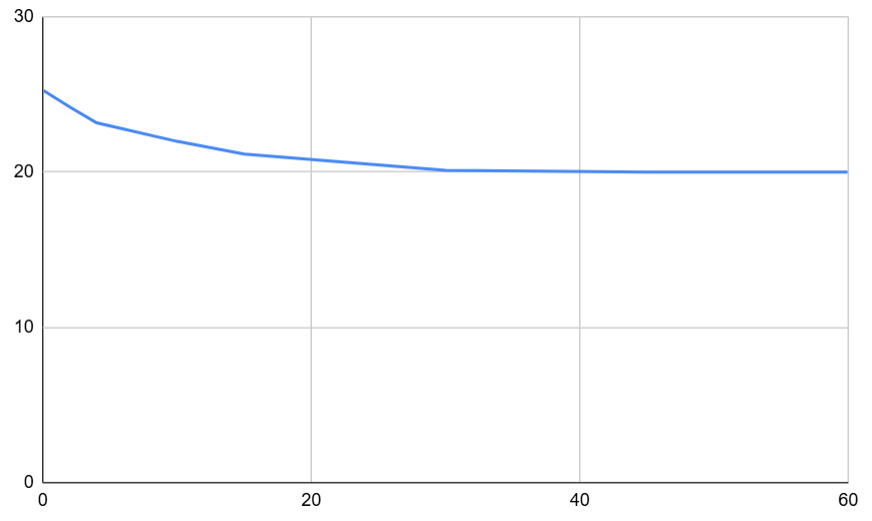

## Комп'ютерні системи імітаційного моделювання
## СПм-24-3, **Прошкін Артем Сергійович**
### Лабораторна робота №**1**. Редагування імітаційних моделей у середовищі NetLogo

<br>

### Варіант 2, модель у середовищі NetLogo:
[Climate Change](https://www.netlogoweb.org/launch#http://www.netlogoweb.org/assets/modelslib/Sample%20Models/Earth%20Science/Climate%20Change.nlogo)

<br>

## Внесені зміни у вихідну логіку моделі, за варіантом:
# 1. Додати можливість вказівки початкової кількості хмар.
Було додано змінну що читає значення інпуту в інтерфейсі, при виконанні функції setup додає хмари відповідно до значення initial-cloud-clusters.
\```
repeat initial-cloud-clusters [
  add-cloud
]
\```

# 2. Додати зміну кута падіння нових сонячних промінів протягом часу (це дозволить імітувати зміну положення сонця протягом доби).
  Було модифіковано функцію create-sunshine для того щоб створювати проміні під різними кутаби для дослідження температури протягом доби.
  В першу чергу було встановлено змінну довжини доби day-length у 10000 тіків симуляції, через інертність в зміні температури. 

Далі було обрано параметри кутів 
- 120 градусів - Південно-Східний нахил (Ранок)
- 180 градусів - Південь (Полудень)
- 240 градусів - Південно-Західний нахил (Вечір)

Наступним чином було додано зсув для жерела променів з min-pxcor до max-pxcor відповідно до кута нахилу.

\```
to create-sunshine
  ;; "day-progress" will go from 0.0 (sunrise) to 1.0 (sunset) repeatedly.
  let day-length 10000
  let day-progress (ticks mod day-length) / day-length

  let sun-angle 120 + (day-progress * 120)

  ;; Move the source of the rays from left (min-pxcor) to right (max-pxcor)
  ;; to match the angle.
  let sun-x min-pxcor + (day-progress * (max-pxcor - min-pxcor))

  ;; don't necessarily create a ray each tick
  ;; as brightness gets higher make more
  if 10 * sun-brightness > random 50 [
    create-rays 1 [
      set heading sun-angle
      set color yellow

      ;; Spawn the ray at the calculated X position at the top of the world.
      setxy (sun-x + random-float 5 - 2.5) max-pycor
      
      if xcor < min-pxcor [ set xcor min-pxcor ]
      if xcor > max-pxcor [ set xcor max-pxcor ]
    ]
  ]
end
\```
замість
\```
to create-sunshine
  ;; don't necessarily create a ray each tick
  ;; as brightness gets higher make more
  if 10 * sun-brightness > random 50 [
    create-rays 1 [
      set heading 160
      set color yellow
      ;; rays only come from a small area
      ;; near the top of the world
      setxy (random 10) + min-pxcor max-pycor
    ]
  ]
end
\```

Далі було змінено функцію обробки влучання лучів encounter-earth до поверхні Землі. 
За допомогою розрахунку значення directness ми вирішуємо - поглинається промінь чи відбивається. При високих значеннях кутів вірогідності відбиття лучів будуть значно більшими. 

\```
to encounter-earth
  ask rays with [ycor <= earth-top] [
    ;; Heading 180 is straight down (Vertical). cos(180) = -1. abs(-1) = 1.0.
    ;; Heading 90 or 270 is horizontal. cos(90) = 0. abs(0) = 0.0.
    let directness abs cos heading
    
    ;; If the angle is shallow (low directness), we increase the effective albedo - more like a mirror
    let effective-albedo albedo + ((1 - albedo) * (1 - directness))

    ;; Decide reflection vs absorption
    ifelse 100 * effective-albedo > random 100
      [ set heading 180 - heading ]  ;; reflect (skip off the surface)
      [ 
        ;; Absorb into the earth
        rt random 45 - random 45 
        set color red - 2 + random 4
        set breed heats 
      ]
  ]
end
\```
замість
\```
to encounter-earth
  ask rays with [ycor <= earth-top] [
    ;; depending on the albedo either
    ;; the earth absorbs the heat or reflects it
    ifelse 100 * albedo > random 100
      [ set heading 180 - heading  ] ;; reflect
      [ rt random 45 - random 45 ;; absorb into the earth
        set color red - 2 + random 4
        set breed heats ]
  ]
end
\```

# 3. Власниій варіант зміни - механізм динамічної зміни альбедо для дослідження явища "positive feedback loop" пов'язаного з температурою Землі та відбиваючою здатністю поверхні. 
Було додано перемикач для встановлення параметру dynamic-albedo? що відповідає за активніст механізму зміни альбедо.
У функціїї go було додано додаткову обробку стану manage-ice-feedback
\```
to go
  ask clouds [ fd cloud-speed ]
  run-sunshine

  ;; If the switch is on, the model takes control of the Albedo value
  ;; simulating the melting or freezing of ice caps based on temperature.
  if dynamic-albedo? [
    manage-ice-feedback
  ]
 
  ask patches with [pycor = earth-top]
    [ update-albedo ]
    
  run-heat
  run-IR
  run-CO2
  
  tick
end
\```
Функція manage-ice-feedback
Для початку треба визначити параметри температур замерзання за плавлення льодяних шапок Землі. 
- < 12 градусів: Льод на Землі починає замерзати (Високе Альбедо)
- > 25 градусів: Льод на Землі починає танути (Низьке Альбедо)
Встановлюємо параметри максимального та мінімального Альбедо.
Виконуємо розрахунок target-albedo відносно температури поверхні Землі та встановлюємо оновлене значення
\```
to manage-ice-feedback
  ;; Define the Temperature Thresholds
  let frozen-temp 12
  let melted-temp 25
  
  ;; Define Albedo Limits
  let max-ice-albedo 0.85  ;; Bright white ice
  let min-ocean-albedo 0.15 ;; Dark heat-absorbing water/land
  
  let target-albedo 0
  
  ;; Calculate Target Albedo based on current Temperature
  ifelse temperature <= frozen-temp [ 
    set target-albedo max-ice-albedo 
  ]
  [ 
    ifelse temperature >= melted-temp [ 
      set target-albedo min-ocean-albedo 
    ]
    [
      ;; Calculate position between frozen and melted (0.0 to 1.0)
      let ratio (temperature - frozen-temp) / (melted-temp - frozen-temp)
      ;; Linear interpolation: As temp goes up, albedo goes down.
      set target-albedo max-ice-albedo - (ratio * (max-ice-albedo - min-ocean-albedo))
    ]
  ]
  
  set albedo (0.99 * albedo) + (0.01 * target-albedo)
end
\```
Додатково відображаемо зміну в альбедо кольором
\```
to update-albedo
  ;; High Albedo (Ice) -> White/Light Blue
  ;; Low Albedo (Water) -> Dark Blue
  set pcolor scale-color blue albedo -0.2 1.5
end
\```


<br>
Графік наочно показує гіпербалічну залежність середньої температури землі від кількості хмар в атмосфері, коли кількість хмар незначна, вони майже не впливають на температуру Землі, однак коли кількість хмар наближається до граничного значення в 45 одиниць, температура землі стабілізується на 20 градусах, кількість частинок тепла що потрапляють на поверню незначна, так само і як вірогідність випромінення теплової енергії з поверхні.

