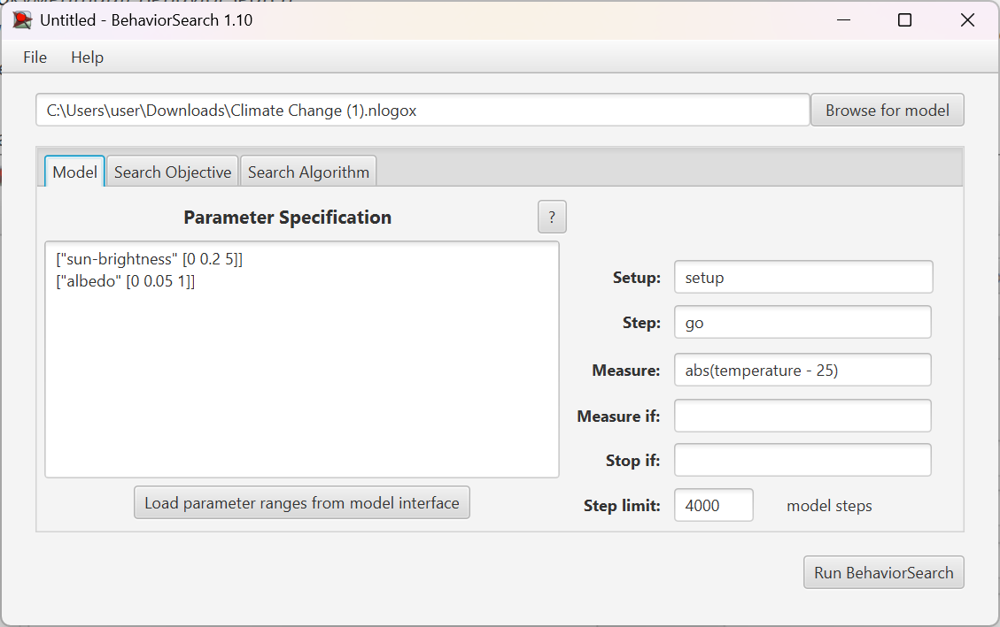
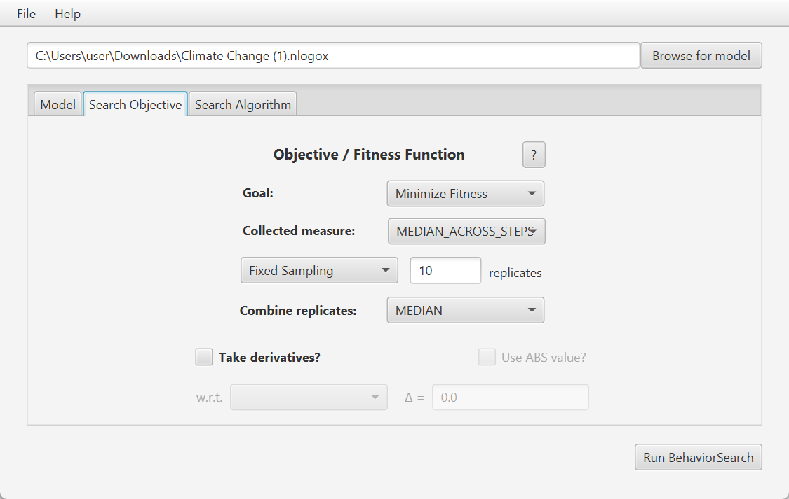
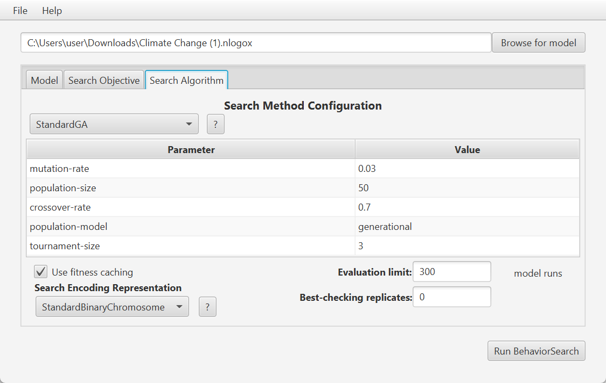
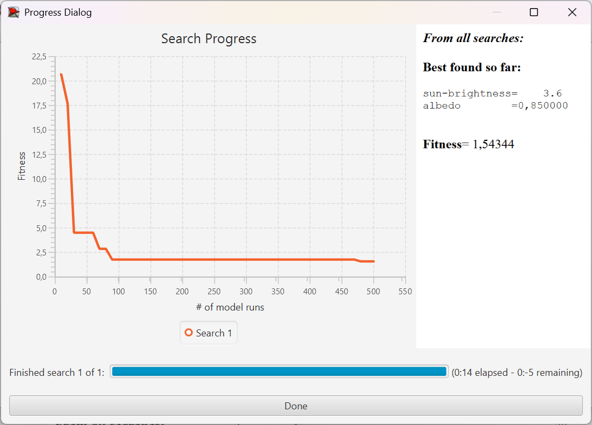
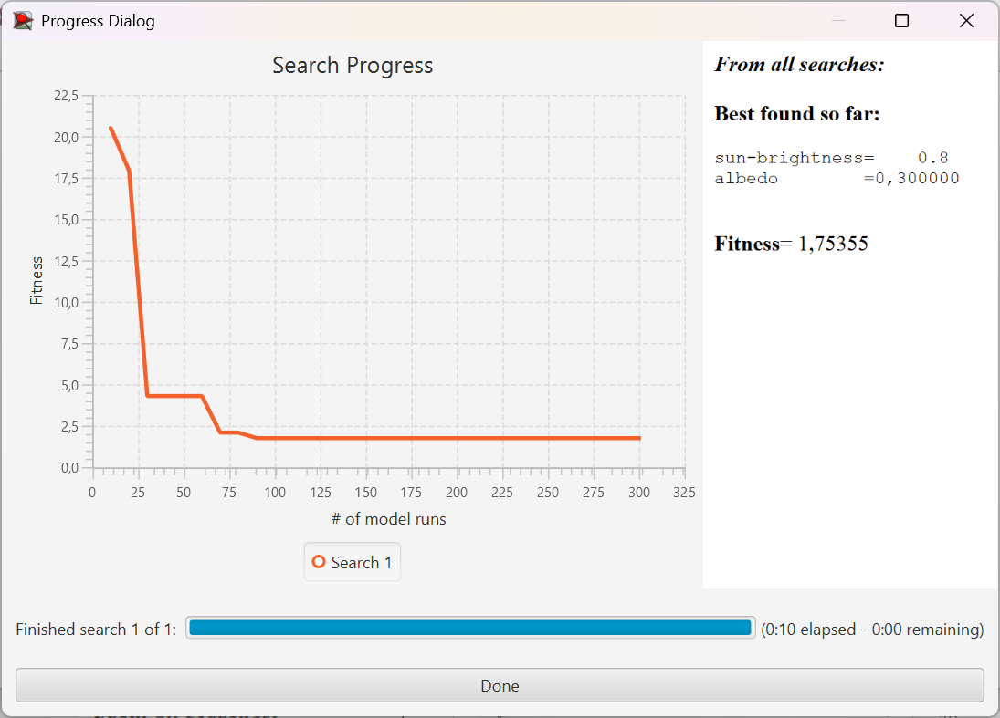

## Комп'ютерні системи імітаційного моделювання
## СПм-24-3, **Прошкін Артем Сергійович**
### Лабораторна робота №**3**. Використання засобів обчислювального интелекту для оптимізації імітаційних моделей
<br>

### Керуючі параметри:
- sun-brightness: Інтенсивність сонячного випромінювання. 
- albedo: Поглинальна здатність поверхні землі.

### Показники роботи модеі:
- temperature: Кількість тепла на поверхні землі.

Налаштування середовища BehaviorSearch:
Обрана модель:

## Варіант 2, модель у середовищі NetLogo:
[Climate Change](https://www.netlogoweb.org/launch#http://www.netlogoweb.org/assets/modelslib/Sample%20Models/Earth%20Science/Climate%20Change.nlogo)
<br>
Параметри моделі (вкладка Model):
```
["sun-brightness" [0 0.2 5]]
["albedo" [0 0.05 1]]
```
Для функції фітнес-функції було обрано значення середнього відхилу температури на поверхні землі. 
Вираз для її розрахунку "Measure": abs(temperature - 25).
Температура землі повинна враховуватися в середньому за весь період симуляції тривалістю, для приклада, 4000 тактів, починаючи з 0 такту симуляції.


<br>

Налаштування цільової функції (вкладка Search Objective):
Метою підбору параметрів імітаційної моделі, що описує зміну клімату, є мінімізація значення відхилу від середньої нормальної температури поверхні землі в 25°C – це вказано через параметр "Goal" зі значенням Mіnimize Fitness. При цьому цікавить не просто середній відхил температури у якийсь окремий момент симуляції, а значення за всю симуляцію (тривалість якої 4000 кроків). Для цього у параметрі "Collected measure", що визначає спосіб обліку значень обраного показника, вказано MEDIAN_ACROSS_STEPS, для того щоб сгладити флуктуації та коливання значень. 


<br>

Налаштування алгоритму пошуку (вкладка Search Algorithm):
Загальний вид вкладки налаштувань алгоритму пошуку:


<br>

# Результати використання BehaviorSearch:
Результат пошуку параметрів імітаційної моделі, використовуючи генетичний алгоритм:


<br>

Результат пошуку параметрів імітаційної моделі, використовуючи випадковий пошук:

<br>

У висновку можна сказати що обидва алгоритми показали достатньо точний, хоч і різний результат у пошуку значень. На графіку генетичного алгоритму можна побачити тенденцію до поступового покращення результату. На графіку випадкового пошуку результат знаходиться з різкими змінами, через невелику кількість початкових комбінацій даних, всого два параметри з 20 варіантами для кожного, що не так багато. 
Також можна побачити що фітнес функція не досягає самого мінімуму, через велику інертність температури та неможливості ставити симуляцію на умовні 20000+ кроків через обмеження системи. 

